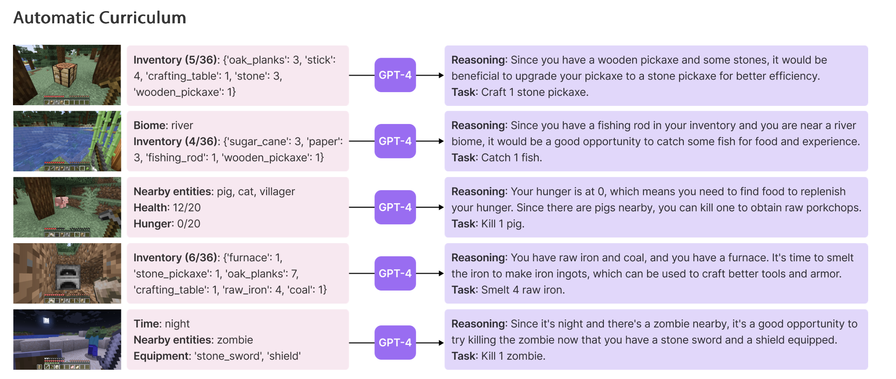

导读：Voyager - 基于大模型的开放世界通用智能体
1. 研究背景与动机
在人工智能领域，开发一个能够像人类一样在开放世界（如《我的世界》）中持续学习、自主探索的“具身智能体”（Embodied Agent）一直是巨大的挑战。传统的强化学习（RL）方法在面对极其复杂的动作空间和稀疏的奖励信号时，往往表现不佳，且难以将学到的知识迁移到新环境中。

Voyager 的出现提出了一种全新的范式：它不通过调整模型参数（Fine-tuning），而是直接利用大语言模型（如 GPT-4）强大的代码生成和推理能力，通过“写代码”的方式驱动游戏角色。研究团队希望解决的核心问题是：如何让 AI 在没有人类干预的情况下，自主规划目标、积累技能，并在陌生的世界里实现“终身学习”。

2. 核心方法
Voyager 的强大归功于其设计的三个关键组件，它们构成了一个闭环的学习系统：

自动课程表 (Automatic Curriculum)：
AI 会根据当前的环境状态（如背包里有什么、身处什么地形）和已有的技能，自主决定下一个目标。比如，它会判断出“先挖木头，再做木镐”，而不是盲目乱跑。

技能库 (Skill Library)：
这是 Voyager 的“记忆池”。每当 AI 成功完成一个复杂动作，它就会将对应的代码段存入库中。下次遇到类似任务时，它只需检索并调用旧代码，像滚雪球一样积累能力。

迭代提示机制 (Iterative Prompting)：
当生成的代码报错或任务失败时，Voyager 会捕获游戏的错误反馈和环境观察，自动反馈给大模型进行自我修正。这种“失败-学习-重试”的机制大大提高了任务的成功率。

[此处建议插入图片：官网 Figure 2 的三个组件架构图，并配文“图 1：Voyager 的三大核心组件及其交互流程”]

3. 主要结果
实验结果表明，Voyager 在《我的世界》中的表现远超之前的 SOTA（最先进）模型（如 AutoGPT, ReAct 等）：

极强的探索能力： 获得的独特物品数量是基准模型的 3.3 倍。

惊人的升级速度： 解锁科技树（如制作钻石镐）的速度比同类模型快了 15.3 倍。

卓越的迁移能力： 在一个完全陌生、从未见过的新地图中，Voyager 能够直接调用之前积累的“技能库”迅速适应，而其他模型几乎只能原地踏步。

4. 个人小结
作为 AI 专业的入门学习者，Voyager 给我带来了很大的启发。它证明了人工智能不一定非要通过大规模的梯度下降来“训练”，通过合理的框架设计和提示工程（Prompt Engineering），大模型完全可以展现出高级的推理与自主进化能力。

这种“代码即技能”的思路，将复杂的动作拆解为可解释、可重用的程序模块，不仅解决了 AI 的“长记性”问题，也让我们看到了通用人工智能（AGI）在具身机器人领域落地的可能性。

